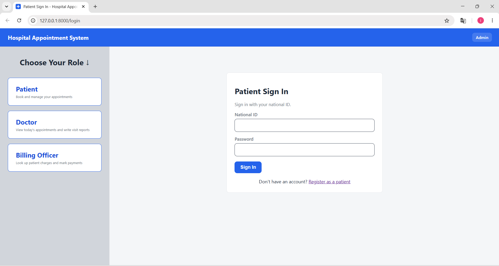
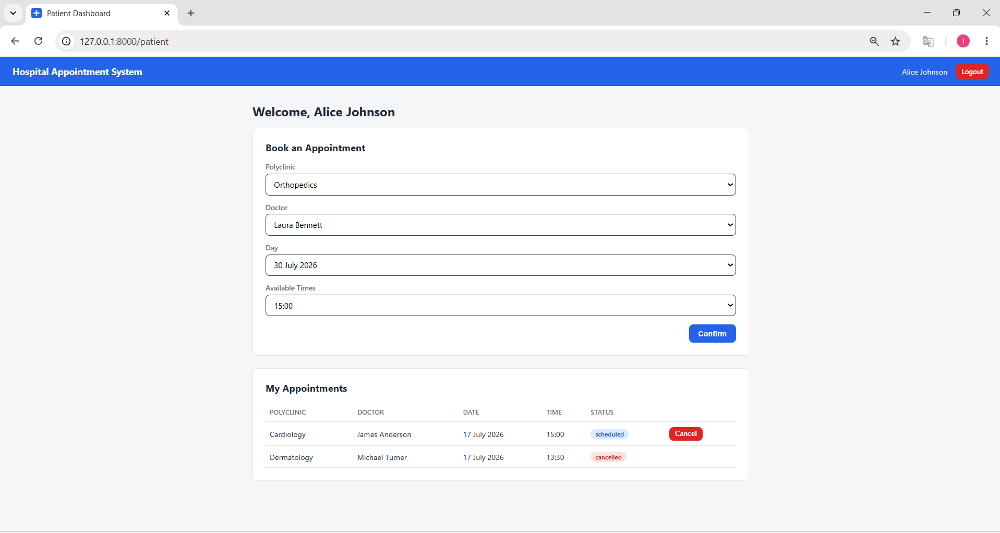
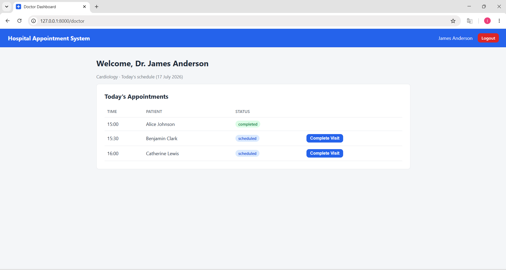
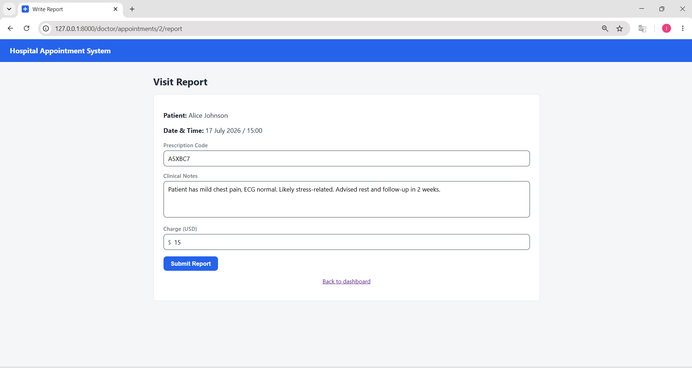
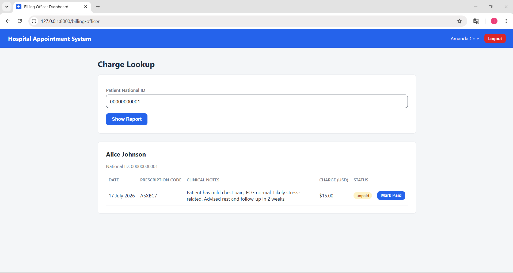
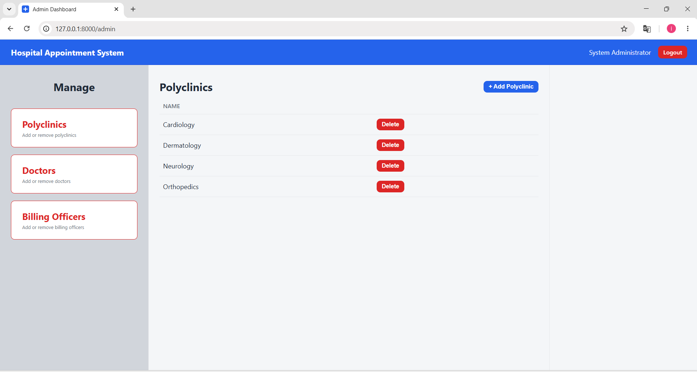
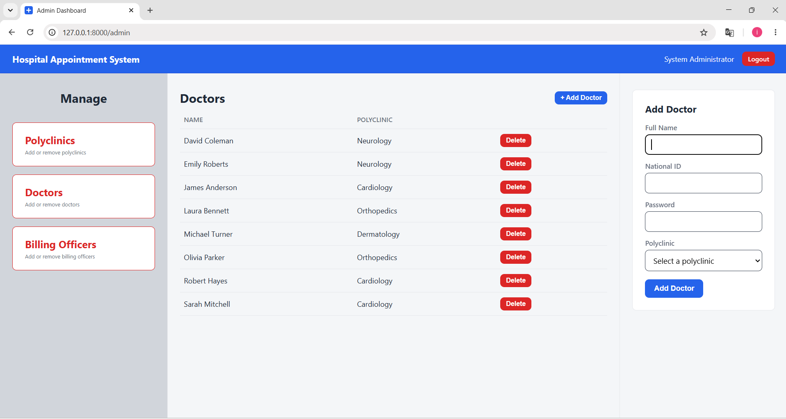

# 🏥 Hospital Appointment System


A full hospital appointment management system where patients book appointments with doctors, doctors record visit reports, billing officers look up and settle charges, and an admin manages the underlying polyclinics, doctors, and billing officers — all with zero database setup, since SQLite runs as a single local file.

---

## 📋 Features

### 🧑‍⚕️ Patient

- Register and log in with a national ID and password
- Book an appointment by choosing a polyclinic → doctor → day → time slot
- View all personal appointments and their status
- Cancel an upcoming scheduled appointment

### 👨‍⚕️ Doctor

- Log in with a national ID and password (account created by Admin)
- View today's appointment schedule
- Mark a patient's visit as completed
- Write a visit report (prescription code, clinical notes, charge)

### 💳 Billing Officer

- Log in with a national ID and password (account created by Admin)
- Look up a patient's visit reports and charges by national ID
- Mark a charge as paid

### 🛠️ Admin

- Log in with a fixed account (`admin` / `admin`)
- Add and remove polyclinics
- Add and remove doctors, assigning each to a polyclinic
- Add and remove billing officers

---

## 🖥️ User Interface

### Login Screen

The landing page — a role picker for Patient, Doctor, and Billing Officer, with the Admin login reachable from the top-right corner. Choosing a role loads its sign-in form on the right without leaving the page. Patients who don't have an account yet can register from a link on the Patient sign-in form.



---

### Patient

After logging in, a patient lands on their dashboard with two sections: booking a new appointment and viewing existing ones. Booking works as a chain of dropdowns — picking a polyclinic loads its doctors, picking a doctor loads the days it has open slots, and picking a day loads its available times. Selecting a time reveals a **Confirm** button that books the appointment. Below that, "My Appointments" lists every appointment the patient has made, with a **Cancel** button on any that are still upcoming and scheduled.



---

### Doctor

The doctor dashboard lists only today's appointments, with the patient's name and the current status of each. A **Complete Visit** button appears on any appointment that's still scheduled; clicking it marks the visit completed and immediately opens the visit report form for that patient.



**Visit Report** — shows the patient's name and the appointment's date and time, followed by fields for a prescription code, clinical notes (diagnosis, findings, and any recommended follow-up such as imaging or lab work), and a charge in USD. Submitting the form — even left blank — always records a report for that visit, so a completed appointment can never be left without one. If the charge is left at zero, the report is automatically marked as paid, since there's nothing to collect.



---

### Billing Officer

The billing officer dashboard has a national ID field and a **Show Report** button — searches only run when the button is clicked, not as the officer types. A matching patient's visit history is shown as a table (date, prescription code, clinical notes, charge, and payment status), with a **Mark Paid** button on any report that's still unpaid. Searching an ID with no matching patient shows a clear "no patient found" message instead of an empty table.



---

### Admin

The admin dashboard is split into three columns: a fixed list of what can be managed on the left (Polyclinics, Doctors, Billing Officers), the corresponding list in the middle, and an add-form on the right that appears only when needed. Every delete action asks for confirmation first.

**Polyclinics** — the simplest of the three: a name, a list of existing polyclinics, and a delete button on each (deleting a polyclinic also removes its doctors).



**Doctors** — same layout, but the add-form takes a full name, national ID, password, and the polyclinic to assign the doctor to.



**Billing Officers** work the same way as doctors, just without a polyclinic to assign — the add-form only asks for a full name, national ID, and password.

---

## 🏗️ Project Structure

```
Hospital-Appointment-System/
├── app/
│   ├── main.py            FastAPI app setup, startup hook
│   ├── config.py           App configuration (database URL, clinic hours, etc.)
│   ├── database.py          SQLAlchemy engine/session setup
│   ├── security.py           Password hashing and session token helpers
│   ├── deps.py                Shared request dependencies
│   ├── seed.py                 Default admin account seeding
│   ├── models/                  SQLAlchemy models (User, Doctor, Polyclinic, Appointment, Report)
│   ├── routers/                  Route handlers per role (auth, patient, doctor, billing_officer, admin)
│   ├── services/                  Business logic (appointment slot scheduling)
│   ├── templates/                  Jinja2 templates (HTML + HTMX partials)
│   └── static/                      CSS
├── images/                           Screenshots used in this README
└── requirements.txt
```

---

## 🗄️ Database

SQLite database (`hospital.db`), created automatically on first run via SQLAlchemy — no separate database server to install or configure.

**Tables:**

- `users` — holds every account (Patient, Doctor, Billing Officer, Admin) with a `role` column; Admin logs in with a username, everyone else with a national ID
- `polyclinics` — the list of departments (Cardiology, Dermatology, etc.)
- `doctors` — links a doctor's user account to a polyclinic
- `appointments` — a patient/doctor pairing at a specific time slot, with a status (`scheduled`, `completed`, `cancelled`)
- `reports` — a visit's prescription code, clinical notes, charge, and payment status, linked one-to-one with a completed appointment

Clinic hours and slot length are configurable in `app/config.py` (default: 09:00–17:00, 30-minute slots, Monday–Friday).

---

## ⚙️ Setup & Run

### Requirements

- [Python 3.11+](https://www.python.org/downloads/)

No database installation is required — SQLite runs as a local file created automatically the first time the app starts.

### 1. Create and activate a virtual environment

```bash
python -m venv .venv
```

**Windows**

```bash
.venv\Scripts\activate
```

**macOS / Linux**

```bash
source .venv/bin/activate
```

### 2. Install dependencies

```bash
pip install -r requirements.txt
```

### 3. Run the app

```bash
uvicorn app.main:app --reload
```

The app opens at [http://127.0.0.1:8000](http://127.0.0.1:8000). On first startup, `hospital.db` and all its tables are created automatically, and a default admin account is seeded.

### 4. Try it out

- Log in to the **Admin** panel with `admin` / `admin` and add a polyclinic, a doctor, and a billing officer.
- Register a new **Patient** account from the login screen and book an appointment with the doctor you just created.
- Log in as that **Doctor**, complete the visit, and write a report.
- Log in as the **Billing Officer** and mark the resulting charge as paid.

---

## 🔑 Logging In

| Role            | Identifier                     | Password               |
| --------------- | ------------------------------ | ---------------------- |
| Admin           | `admin`                      | `admin`              |
| Patient         | National ID (self-registered)  | chosen at registration |
| Doctor          | National ID (created by Admin) | set by Admin           |
| Billing Officer | National ID (created by Admin) | set by Admin           |

---

## ⚠️ Notes

- Passwords are hashed with bcrypt before being stored — nothing is kept in plain text.
- The SQLite database file (`hospital.db`) is excluded from version control via `.gitignore`, so each clone starts empty aside from the seeded admin account.
