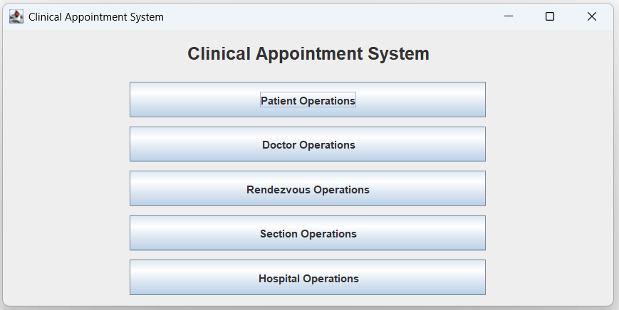
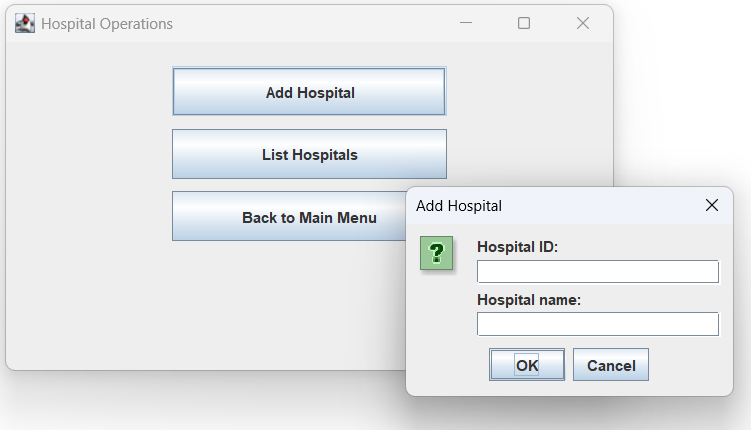
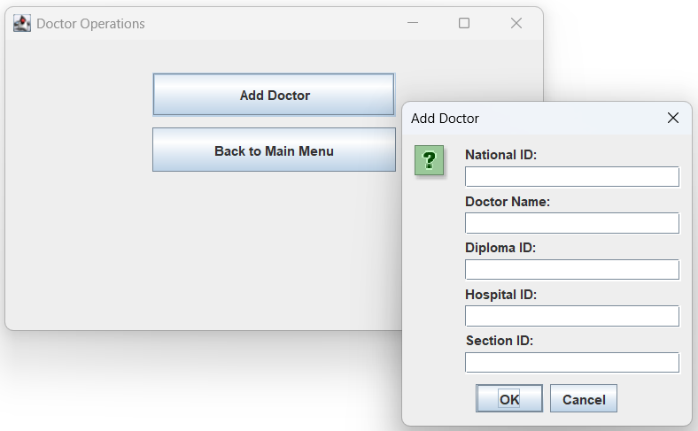
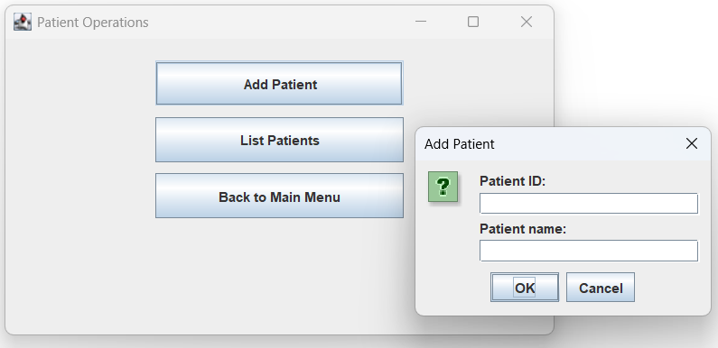
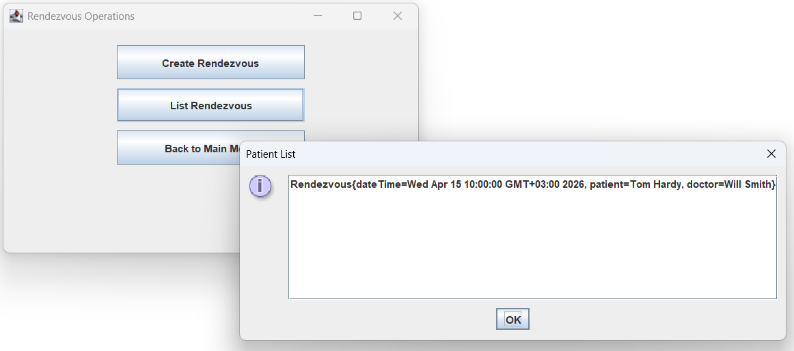

# 🏥 Clinical Appointment System (CRS)


A **Java-based Clinical Appointment Management System** that allows managing patients, doctors, hospitals, sections, and appointments (rendezvous).  
The system supports both **Console (CLI)** and **Graphical User Interface (GUI)** modes.

---

## 🚀 Features

- 👤 Patient management (add / list)
- 👨‍⚕️ Doctor management (assign to hospital & section)
- 🏥 Hospital management
- 🧩 Section management within hospitals
- 📅 Appointment (Rendezvous) creation and listing
- 💾 Persistent data storage using serialization (`Datas.dat`)
- 🖥️ Dual interface:
  - Console-based interaction
  - Swing-based GUI

---

## 🖼️ Application

### 🏠 Main Menu — System Navigation Hub

The main entry point of the application. From here, users can navigate to all core modules including patient, doctor, hospital, section, and appointment management.



---

### 🏥 Hospital Operations — Managing Hospitals

Allows users to:
- Add new hospitals into the system
- View all registered hospitals

Hospitals act as the top-level structure that contains sections and doctors.



---

### 👨‍⚕️ Doctor Operations — Assigning Doctors

Used to:
- Add doctors with a **diploma ID**
- Assign doctors to a specific **hospital and section**

Each doctor is automatically given a schedule for appointment management.



---

### 👤 Patient Operations — Patient Registration

Provides functionality to:
- Register new patients using a **national ID**
- List all existing patients

Patients are required for creating appointments.



---

### 📅 Rendezvous Operations — Appointment Management

Core feature of the system. Enables:
- Creating appointments between patients and doctors
- Listing all appointments

Includes:
- Date & time selection
- Daily appointment limit control (max 10 per doctor)



---

## 🧱 Project Structure

```
.
├── images/
├── src/
│   ├── exception/
│   ├── model/
│   └── test/
├── Datas.dat
└── README.md
```

---

## ⚙️ How It Works

### 🔹 Core System (CRS)

- Manages:
  - Patients (`HashMap<Long, Patient>`)
  - Hospitals (`HashMap<Integer, Hospital>`)
  - Rendezvous (`LinkedList<Rendezvous>`)
- Responsible for:
  - Adding entities
  - Creating appointments
  - Saving/loading data

### 🔹 Appointment Logic

- Each **Doctor** has a `Schedule`
- Default limit: **10 patients per day**
- Checks:
  - Valid IDs (patient, hospital, section, doctor)
  - Daily capacity

---

## 💻 Running the Application

### Compile

javac -d bin src/model/*.java src/exception/*.java

### Run

java -cp bin model.Main

---

## 🎮 Mode Selection

1: GUI mode  
2: Console mode  

- GUI → Swing interface  
- Console → Terminal interaction  

---

## 💾 Data Persistence

- File: `Datas.dat`
- Uses Java Serialization
- Automatically:
  - Saves after operations
  - Loads before usage

---

## ⚠️ Exception Handling

- `IDException` → Invalid IDs  
- `DuplicateInfoException` → Duplicate entries  

---

## 🧪 Testing

Located in:

src/test/

---

## 🧠 Design Overview

- Object-Oriented Design
- Layer separation:
  - model → logic
  - exception → error handling
- Uses:
  - Collections
  - Serialization
  - Java Swing

---

## 📌 Notes

- IDs must be unique
- GUI has limited validation
- Data file is auto-created if missing

---

## 👨‍💻 Author

Clinical Appointment System Project (Java)

---

## 📄 License

Educational use only
